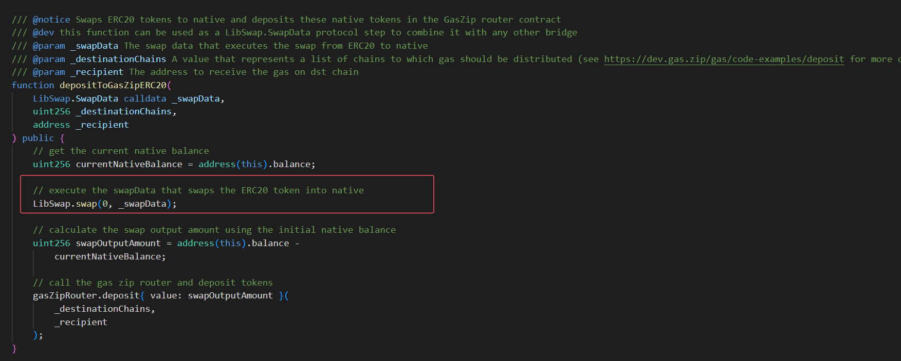
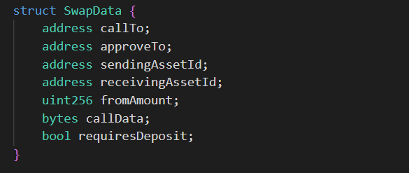
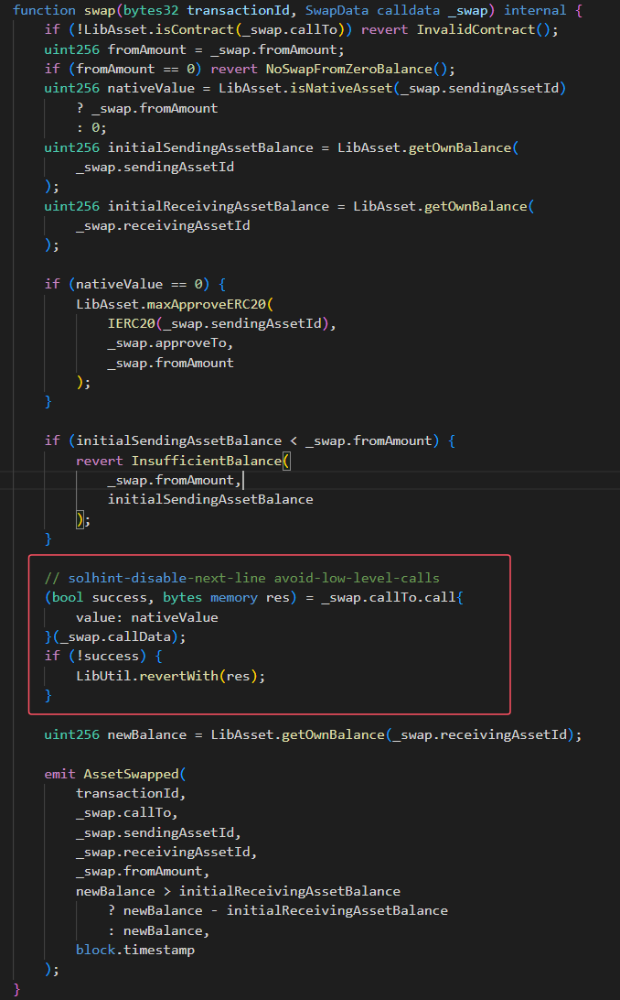

该漏洞为2024 年 7 月 16 日发生在LI.FI合约合约上面的攻击，原因在于被攻击合约对攻击者传入参数校验不严格，导致攻击者可以通过构造特殊inputData来使受害者合约调用任意合约并传入任意参数。最终，攻击者利用特殊的参数，使得受害者合约通过transferFrom将授权给其合约的代币转入到攻击者控制的地址。

首先`GasZipFacet\src\Facets\GasZipFacet.sol`中的depositToGasZipERC20调用了`GasZipFacet\src\Libraries\LibSwap.sol`的LibSwap.swap函数：

SwapData的结构如下：

LibSwap.swap函数如下：

只要控制了swap函数的参数_swap，既就可以利用LI.FI Protocol合约调用任意合约，传入任意参数，攻击者通过传入transferFrom作为callData利用LI.FI Protocol将授权给LI.FI的合约中的代币转移给自己